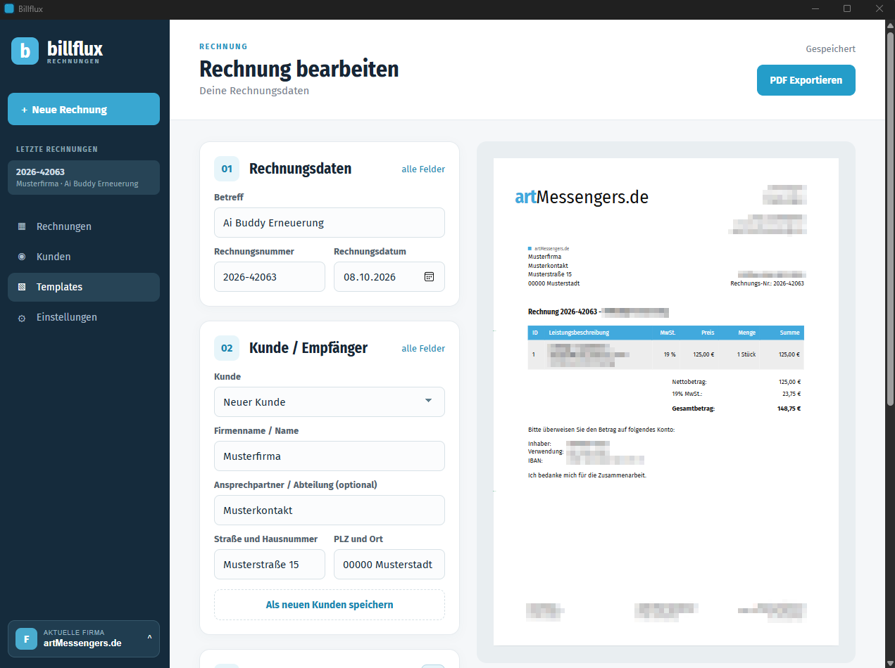

# Billflux

Billflux is a portable Windows desktop application for creating and managing invoices. It uses Rust and Tauri, stores data locally, and generates PDFs with embedded ZUGFeRD/Factur-X invoice XML.

## Features

- Manage companies, customers, drafts, and issued invoices in a local SQLite database.
- Create, duplicate, edit, and delete invoice drafts; configure numbering and payment details per company.
- Preview and select invoice templates built from HTML and CSS. Templates can include fonts and PNG images.
- Render paginated A4 invoices.
- Export PDF/A-3 invoices with embedded CII XML. Billflux validates the PDF, XML, and overall ZUGFeRD result before saving the export.
- Keep exported PDFs and validation reports in the logs folder beside the executable.

## Install the portable build

1. After Building your release (Releas comming soon) run dist/Billflux.exe. No installer or Rust installation is needed. The complete distribution already contains the Java, Ghostscript, and Chrome Headless Shell components used for PDF export.
2. Billflux uses Microsoft Edge WebView2 for its interface. It is usually present on current Windows 10 and Windows 11 systems. Install the [WebView2 Runtime](https://developer.microsoft.com/en-us/microsoft-edge/webview2/) if it is missing.
3. Enter your company details, choose a template, and create an invoice. A fresh database starts with an example company and template. If a saved template is missing, Billflux activates the first available template alphabetically.

Billflux creates database, logs, and preview folders beside the executable. The file database/billflux.sqlite holds your invoice and customer data; back it up regularly. To move your installation to another PC, copy the entire folder. To share a clean copy, exclude your personal database, logs, and preview folders. Unsigned builds may trigger Windows SmartScreen; verify the download source before running them.

## Build from source on Windows

Building is only required if you want to modify Billflux or create a distribution. Install [Rust with rustup](https://rust-lang.org/install.html), Microsoft C++ Build Tools with the **Desktop development with C++** workload, and Microsoft Edge WebView2. See the [Tauri Windows prerequisites](https://v2.tauri.app/start/prerequisites/).

The build also needs Mustang CLI 2.26.0, Ghostscript, a Java 11 runtime, PDFA_def.ps, and an sRGB ICC profile prepared under .tools. **These tools are not committed to this repository.** Consult [ZUGFeRD validation and tool locations](docs/zugferd-validierung.md) before building. The script downloads a pinned Chrome Headless Shell build and verifies its SHA-256 hash.

From PowerShell in the repository root:

    powershell.exe -NoProfile -ExecutionPolicy Bypass -File .\scripts\build-portable.ps1 -KeepBuildCache

The result is dist/Billflux. Omit -KeepBuildCache to remove Cargo build artifacts afterward. The script retains existing databases, exports, and templates in that folder. Run cargo test for the Rust test suite.

## Templates

A template folder next to Billflux.exe must contain invoice.html and style.css. Optional fonts and PNG assets can be placed alongside them. Billflux replaces supported {{...}} placeholders with invoice, company, customer, line item, and payment data. Preview a template in the app before exporting.

## Third-party software and licensing

Rust crates, including Tauri and rusqlite, are listed in Cargo.toml and Cargo.lock. The portable build also contains Mustang CLI, Ghostscript, Eclipse Temurin, Chrome Headless Shell, and Fira fonts. Each has separate license terms. See [LICENSE.md](LICENSE.md) and the notices included with those components.

**Licensing is under review.** LICENSE.md is a draft inventory, not a final license grant for Billflux. Bundled Ghostscript is subject to the GNU AGPL. The complete portable distribution and its notices must be reviewed before a public release.

## Project layout

- src/ — Rust application, invoice model, HTML/XML generation, and PDF export.
- ui/ — Tauri interface.
- templates/ — source invoice templates.
- fonts/ — Fira fonts and OFL notices.
- scripts/build-portable.ps1 — portable Windows build.
- docs/ — PDF validation and implementation notes.
